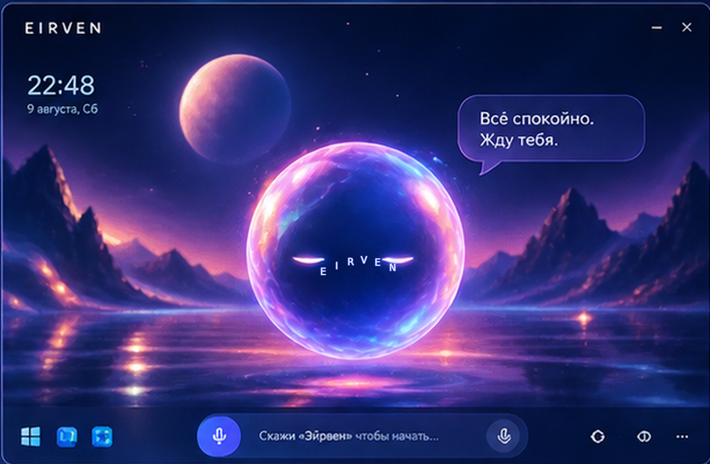
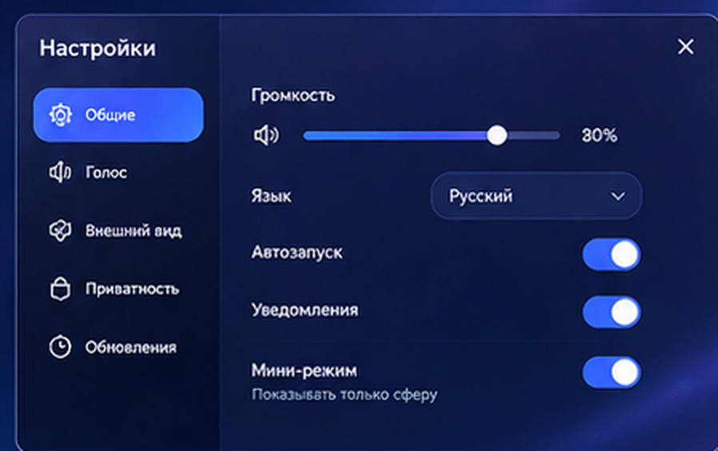
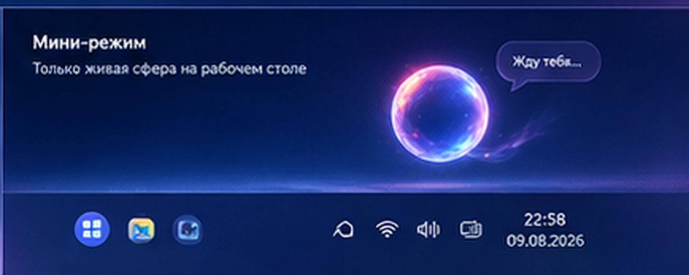

<p align="center">
  
</p>

<h1 align="center">E I R V E N</h1>
<p align="center"><b>Живой voice-first ИИ-компаньон для Windows, который не только отвечает, но и действует.</b></p>
<p align="center">Создатель: <b>Даниил</b></p>

<p align="center">
  
  
  
  
</p>

## Что такое EIRVEN

EIRVEN — локально-ориентированный персональный ИИ для Windows. Она активируется обращением **«Эрви»**, слушает фразу до конца, отвечает голосом и может выполнять действия в приложениях, браузере и системе. Главный интерфейс — живая liquid-glass сфера: в покое она мягкая, при активации становится ярче, во время размышления и речи меняет движение и показывает понятный статус без технической консоли.

Публичная версия имеет одну цельную личность и один фирменный голос — **Бая**. Пол и мужские голосовые профили в продукте не выбираются.

## Что умеет

- Голосовая активация по слову **«Эрви»** с 5-секундным окном на начало фразы.
- Дослушивание длинной мысли без обрыва по фиксированному таймеру.
- Перебивание ответа: Эйрвен затухает и переключается на слушание.
- Аварийная голосовая отмена без имени, которая гасит активную миссию, фоновые задачи и очередь действий.
- Реальный прогрев ASR/TTS при запуске: первый запрос больше не инициирует холодную инференцию сам.
- Открытие приложений и сайтов, навигация по текущему интерфейсу.
- Работа с Telegram Web: открыть чат, отправить сообщение, переиспользовать открытую вкладку.
- Управление Яндекс Музыкой: воспроизведение, пауза, лайк/дизлайк и переходы по интерфейсу.
- Действия на сайтах: разделы, поиск, карточки, корзина — по видимому состоянию страницы.
- Системные команды Windows: громкость, окна, процессы и другие атомарные действия.
- Длинные задачи и фоновые миссии с проверкой результата.
- Локальный видеомонтаж через FFmpeg: склейка, обрезка, улучшение, конвертация, скорость, звук, кадр, текст и другие операции обычной голосовой командой.
- Смена стратегии после четырёх неудачных подходов, локальный журнал опыта и обучаемые маршруты.
- Структурированная память, адресное забывание и откат поддерживаемых изменений файлов.
- Необязательное управление с телефона через Telegram с точным allowlist и префиксом.
- Нативный Android-клиент в домашней сети: защищённое подключение по отдельному коду, чат, голос, задачи, документы и видео.
- Автопривязка текущего Telegram-чата без ручного поиска ID: защищённое 10‑минутное окно и одноразовый код.
- Моментальный разговорный контур через одну прогретую локальную Ollama-модель; Claude Code используется как агентная оболочка только для code/deep-задач, где она действительно полезна.
- Честная диагностика фактической модели: Claude Code CLI не выдаётся за локальные проприетарные веса Claude.
- Сохранённые контрольные точки авторизации: «Эрви, готов» продолжает тот же шаг, а повтор не отменяет уже запущенное продолжение.
- Desktop mini-mode: живая сфера поверх рабочего стола, выразительные глаза по состоянию и человеческие комментарии о текущем действии.
- Обновления из **GitHub Releases** репозитория `FoxInDev/EIRVEN-AI`.

> EIRVEN не выдаёт непроверенный side-effect за успех: отправка сообщения, добавление в корзину и другие commit-действия должны подтверждаться состоянием интерфейса.

## Интерфейс

### Живая сфера

<p align="center"></p>

Внутри сферы — чистая cosmic-glass текстура и отдельная живая мимика. Небольшие драгоценные глаза моргают и выражают состояние, а рот двигается по реальной амплитуде произносимых слогов; человеческие глаза и случайные готовые выражения не рисуются.

### Настройки

<p align="center"></p>

Настройки разделены на **Общее / Голос / Внешний вид / Приватность / Видео / Телефон / Telegram / Обновления**. В «Телефон» автоматически появляется QR-код: камера телефона открывает локальную ссылку и скачивает встроенный APK; рядом остаются адрес компьютера и отдельный код подключения. В «Общее» есть безопасная кнопка **Отключить EIRVEN**, во «Внешний вид» — переключатель живых глаз, а в «Видео» — инструкция и кнопка папки исходников. Ручных переключателей эмоций и скорости речи нет — подача выбирается автоматически.

### Видео

Открой раздел **Настройки → Видео** или просто спроси: **«Эрви, как смонтировать видео?»**. Эйрвен сама откроет папку `video`. Положи туда все исходники: сразу после завершения копирования они автоматически получают понятные номера (`1.mp4`, `2.mov`, `3.mkv`), а перед монтажом дополнительно проверяются. Затем опиши результат обычными словами — например: **«работай только с первым видео»**.

Примеры: **«склей все по порядку»**, **«у первого убери первые 5 секунд и склей все»**, **«после склейки оставь от 00:10 до 01:20»**, **«сделай 1080p и немного улучши резкость»**. Неоднозначную команду Эйрвен не угадывает молча, а уточняет простыми словами. Полная памятка: **[docs/VIDEO_RU.md](docs/VIDEO_RU.md)**.

### Первый запуск

<p align="center"></p>

Первый запуск короткий: имя Эйрвен → стиль общения → имя пользователя → запуск. Голос фиксирован на Бае.

### Mini-mode

<p align="center"></p>

На рабочем столе Эйрвен может просто оставаться рядом маленькой живой сферой. Глаза реагируют на listening / thinking / speaking / success, а комментарии оформлены как короткие liquid-glass карточки. Глаза и сами комментарии можно отключить отдельно.

## Быстрая установка Windows

<p align="center"></p>

На чистом Windows-компьютере заранее не нужны Python, Node.js, Ollama или Claude Code: PowerShell-установщик скачивает и проверяет недостающее сам. Нужны только Windows 10/11 x64, интернет и подтверждение стандартного UAC.

1. Открой **Releases** этого репозитория и скачай последний `EIRVEN-Windows-v*.zip`.
2. Распакуй архив в обычную пользовательскую папку, например `C:\EIRVEN`. Не устанавливай в `Program Files`.
3. Запусти `INSTALL EIRVEN AI.cmd`.
4. Дождись окончания единой полосы установки. Если временно падает сеть, pip, модель или другой шаг, установщик повторяет его и при необходимости перезапускает bootstrap до трёх раз — уже скачанное не удаляется.
5. После готовности EIRVEN запустится сама и откроет onboarding.
6. Закончи знакомство и скажи: **«Эрви, привет»**.

Подробно: **[docs/INSTALLATION_RU.md](docs/INSTALLATION_RU.md)**.

## Естественное демо

Готовый сценарий 2–3-минутного ролика с командами, паузами и планом кадров: **[docs/DEMO_SCRIPT_RU.md](docs/DEMO_SCRIPT_RU.md)**.

## Обновление уже установленной r37

Если EIRVEN уже установлена и в папке есть `.venv`, распакуй новый архив **поверх исходников** и один раз запусти `UPDATE EIRVEN AI.cmd`. Этот путь не скачивает модели заново: он обновляет editable-код, пересобирает оба Windows-launcher’а (`EIRVEN-AI.exe` и `EIRVEN-AI-r37.exe`), обновляет ярлыки и запускает текущую сборку. Если окружение неполное, скрипт сам переключится на обычный `INSTALL EIRVEN AI.cmd`.

После этого обычные запуски через `EIRVEN-AI.exe`, `EIRVEN-AI-r37.exe`, ярлык или `EIRVEN AI.cmd` используют один и тот же `launcher.py` и одну локальную базу настроек.

## Обновления

В разделе **Настройки → Обновления** EIRVEN обращается к GitHub Releases. Stable-канал использует последний стабильный релиз, preview-канал может показать prerelease. Если в релизе есть Windows ZIP, интерфейс предлагает скачать именно его.

Подробнее: **[docs/UPDATES_RU.md](docs/UPDATES_RU.md)**.

## Документация

- [Установка Windows](docs/INSTALLATION_RU.md)
- [Функции и ограничения](docs/FEATURES_RU.md)
- [Видео: монтаж и примеры команд](docs/VIDEO_RU.md)
- [Архитектура](docs/ARCHITECTURE_RU.md)
- [Приватность и безопасность](docs/PRIVACY_RU.md)
- [Обновления через GitHub](docs/UPDATES_RU.md)
- [Сценарий демонстрации](docs/DEMO_SCRIPT_RU.md)
- [Публикация и релизы GitHub](docs/GITHUB_PUBLISH_RU.md)
- [Диагностика](docs/TROUBLESHOOTING_RU.md)
- [Пользовательский аудит 1.7.3 r37](docs/USER_PERSPECTIVE_AUDIT_R37_RU.md)
- [Пользовательский аудит 1.7.3 r36](docs/USER_PERSPECTIVE_AUDIT_R36_RU.md)
- [Пользовательский аудит 1.7.3 r35](docs/USER_PERSPECTIVE_AUDIT_R35_RU.md)
- [Пользовательский аудит 1.7.3 r34](docs/USER_PERSPECTIVE_AUDIT_R34_RU.md)
- [Release 1.7.3 r34](docs/RELEASE_1.7.3_R34_RU.md)
- [Release 1.7.2](docs/RELEASE_1.7.2_RU.md)
- [Release 1.7.1](docs/RELEASE_1.7.1_RU.md)
- [Release 1.7.0](docs/RELEASE_1.7.0_RU.md)
- [Release 1.6.1](docs/RELEASE_1.6.1_RU.md)
- [Release 1.6.0](docs/RELEASE_1.6.0_RU.md)
- [Release 1.5.0](docs/RELEASE_1.5.0_RU.md)
- [Локальные модели и профили железа](docs/MODELS_RU.md)
- [Release 1.4.0](docs/RELEASE_1.4.0_RU.md)
- [Release 1.2.2](docs/RELEASE_1.2.2_RU.md)
- [Работа с обратной связью](docs/FEEDBACK_POLICY_RU.md)
- [Целостность публичного репозитория](docs/REPOSITORY_INTEGRITY_RU.md)

## Что нового в 1.7.3

- r34 автоматически создаёт узкое правило Windows Firewall для текущего порта и выбирает реальный Wi‑Fi выше VPN/WSL/Hyper‑V; в разделе «Телефон» видны все найденные адреса и точная причина недоступности;
- в «Настройки → Телефон» автоматически строится QR из текущего Wi‑Fi адреса; сканирование сразу скачивает включённый в Windows-раздачу подписанный APK;
- составные фразы из двух действий, включая «включи музыку и открой тг», превращаются в последовательный кросс-приложенческий план;
- Telegram удерживает уже найденное окно по HWND, не путает верхнее поле поиска с панелью браузера и имеет ограниченное визуальное восстановление без слепого ввода;
- обычные английские слова произносятся как слова, а настоящие сокращения — как сокращения; финальный suffix потокового ответа больше не выпадает;
- перед закрытием аудиоустройства добавлен короткий тихий хвост, защищающий последнюю фонему от обрезания Windows-драйвером;
- установочная проверка требует полный Python-free bootstrap-контур, строгую валидную подпись установщика Python и включённый подписанный Android APK.

Полные заметки: **[docs/RELEASE_1.7.3_R34_RU.md](docs/RELEASE_1.7.3_R34_RU.md)**. Результаты пользовательского прогона: **[docs/USER_PERSPECTIVE_AUDIT_R34_RU.md](docs/USER_PERSPECTIVE_AUDIT_R34_RU.md)**.

## Что нового в 1.7.2

- настольная EIRVEN и приложенный Android-клиент теперь совместимы: добавлены мобильные API, экран подключения и безопасный LAN-доступ по отдельному коду;
- цифры, время, проценты, версии, URL и английские слова больше не выпадают из русской озвучки;
- длинная речь делится на естественные короткие части и не теряет конец ответа при заполненной очереди;
- через 8 секунд интерфейс честно сообщает о задержке; через 60 секунд без данных предлагает повторить, а текущий ответ можно остановить;
- набранная следующая команда сохраняется, хвост потокового ответа не пропадает, ошибки задач показаны понятным текстом;
- расширены естественные варианты команд: «скинь», «вруби», «зайди», «в телеге», «я уже вошёл, продолжи».

Полные заметки: **[docs/RELEASE_1.7.2_RU.md](docs/RELEASE_1.7.2_RU.md)**. Результаты пользовательского прогона: **[docs/USER_PERSPECTIVE_AUDIT_R32_RU.md](docs/USER_PERSPECTIVE_AUDIT_R32_RU.md)**.

## Что нового в 1.7.1

- видео автоматически получают номера сразу после завершения копирования в папку `video`, без отдельной команды;
- короткие продолжения вроде «у всех видео» сохраняются как часть текущего запроса, а «я положил видео» подтверждает найденные файлы;
- исправлены обнаруженные в голосовом журнале варианты `ка смонтировать`, `1 080`, «по4», «первый вариант» и «повысь резкость без изменений»;
- фразы «принимай монтаж» и «мне всё нравится» теперь сразу принимают готовый результат.

Полные заметки: **[docs/RELEASE_1.7.1_RU.md](docs/RELEASE_1.7.1_RU.md)**.

## Что нового в 1.7.0

- добавлен полноценный локальный видеоконтур с проверкой исходников, нумерацией файлов и фоновым FFmpeg-монтажом;
- Эрви открывает папку `video` при вопросах о монтаже и даёт понятные примеры формулировок;
- неоднозначная обрезка, область применения эффекта, целевое качество и вертикальное кадрирование уточняются до запуска;
- принятый проект очищает входную папку без потери данных: исходники архивируются, готовые ролики сохраняются отдельно.

Полные заметки: **[docs/RELEASE_1.7.0_RU.md](docs/RELEASE_1.7.0_RU.md)**.

## Что нового в 1.6.1

- надпись «Бая» теперь всегда означает реального спикера `baya` из Silero V5.5 RU; Piper Irina и другие скрытые подмены запрещены;
- исправлена Windows-кодировка, из-за которой исправный голос Baya ошибочно проваливал контроль разборчивости;
- VAD переведён в строгий режим с калибровкой фона: шум RMS `0,006–0,008` больше не удерживает запись 35 секунд;
- статус «слушаю» появляется только после реальной ASR-инференции и очистки стартового аудиобуфера;
- GigaAM V3 E2E CTC заменил более медленный RNN-T-контур, а повторы вроде «Привет. Эрве. Эрви, привет» обрабатываются мгновенным контуром без LLM.

Полные заметки: **[docs/RELEASE_1.6.1_RU.md](docs/RELEASE_1.6.1_RU.md)**.

## Разработка

```powershell
py -3.12 -m venv .venv
.\.venv\Scripts\Activate.ps1
python -m pip install -U pip
pip install -e ".[dev,voice,desktop]"
pytest -q
```

## Репозиторий

Основной репозиторий: `FoxInDev/EIRVEN-AI`  
Ветка релизов: `main`  
Теги: `vMAJOR.MINOR.PATCH`

## Автор

**Даниил** — создатель EIRVEN.

## Лицензия

MIT. См. [LICENSE](LICENSE). Используемые сторонние компоненты перечислены в [THIRD_PARTY_NOTICES.md](THIRD_PARTY_NOTICES.md).
