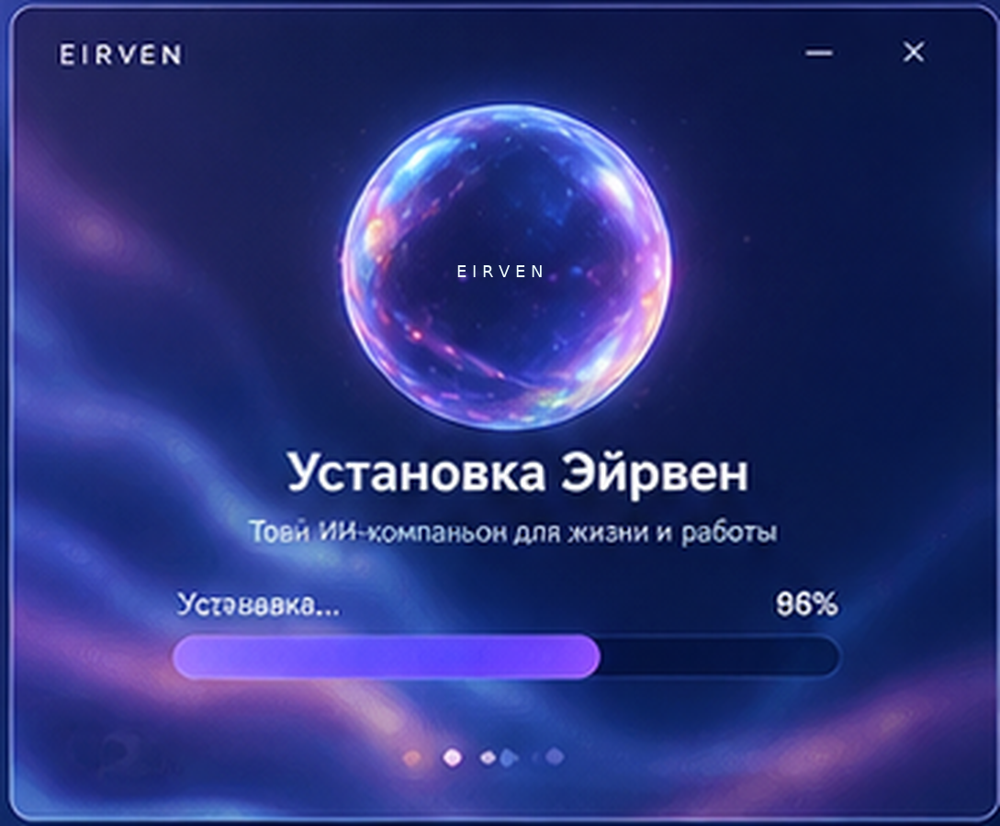
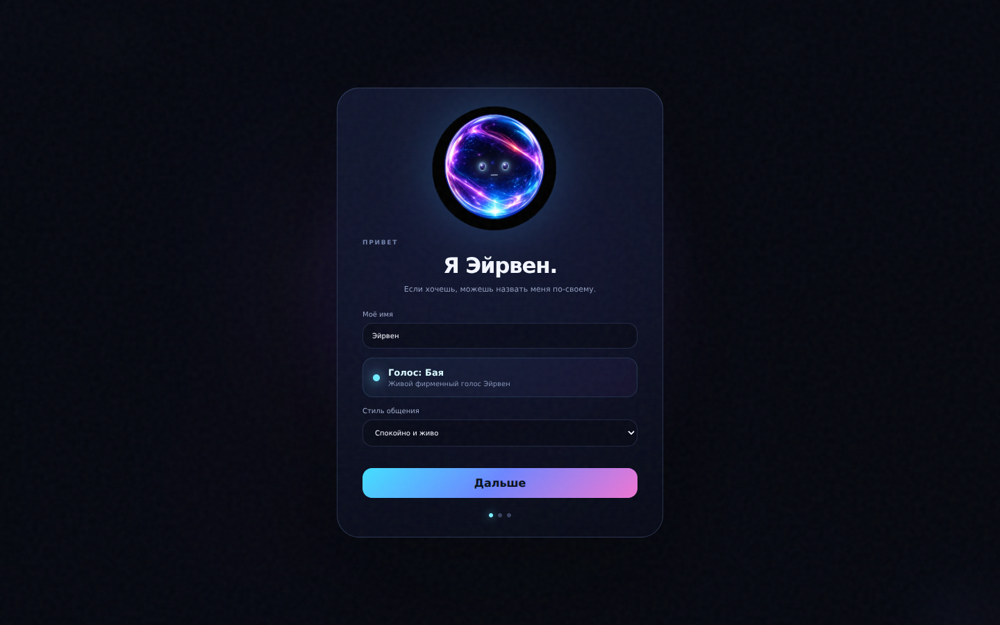

# Установка EIRVEN на Windows

## 1. Требования

Основная публичная сборка ориентирована на **Windows 10/11 x64**. Нужны микрофон, динамики/наушники, интернет для первой загрузки runtime/моделей и несколько гигабайт свободного места под локальные модели и виртуальное окружение.

Рекомендуется распаковать EIRVEN в пользовательскую папку, например:

```text
C:\EIRVEN
```

Не рекомендуется `C:\Program Files\...`: EIRVEN создаёт локальное окружение, модели, runtime-data и обновления рядом со своей установкой.

## 2. Скачать релиз

Открой страницу **Releases** репозитория `FoxInDev/EIRVEN-AI` и скачай файл вида:

```text
EIRVEN-Windows-v1.2.2.zip
```

Архив исходников GitHub (`Source code.zip`) — не основной пользовательский установщик.

## 3. Распаковать

Полностью распакуй ZIP. Не запускай installer прямо из окна архиватора.

## 4. Запустить установку

Дважды кликни:

```text
INSTALL EIRVEN AI.cmd
```

или из PowerShell:

```powershell
powershell -NoProfile -ExecutionPolicy Bypass -File .\scripts\ensure_runtime.ps1
```

Установщик показывает общий прогресс. Он подготавливает Python-окружение, официальный Claude Code CLI, Ollama, русское распознавание речи, фирменный голос Бая и локальную модель под доступное железо. Anthropic API-ключ для этого режима не нужен.

<p align="center"></p>

Если часть сетевой загрузки временно недоступна, v1.2.2 сама повторит шаг и при необходимости автоматически перезапустит bootstrap. Уже скачанные компоненты сохраняются.

## 5. Первый запуск

После завершения installer стартует EIRVEN. Первый экран:

1. Имя Эйрвен — можно оставить как есть или изменить.
2. Стиль общения.
3. Твоё имя.
4. Кнопка **Запустить**.

До завершения onboarding сфера уже отображается, но голосовые команды не исполняются.

<p align="center"></p>

## 6. Голосовая активация

После запуска скажи:

```text
Эрви, привет
```

Если произнести только `Эрви`, открывается окно ожидания примерно на 5 секунд. Если ты начал говорить, EIRVEN слушает до естественного окончания мысли и не обрывает фразу из-за истечения этих пяти секунд.

## 7. Разрешения Windows

При запуске Windows может показать UAC. Расширенный доступ нужен, если EIRVEN должна взаимодействовать с окнами, запущенными от администратора. Если отклонить UAC, обычные пользовательские приложения продолжат работать, но возможности управления elevated-окнами будут ограничены.

## 8. Telegram и управление с телефона

EIRVEN умеет принимать команды с телефона через твой обычный Telegram-аккаунт. Для этого открой `Настройки → Telegram`. Подключение необязательно и выключено по умолчанию.

### Где взять API ID и API Hash

1. В браузере открой `https://my.telegram.org`.
2. Войди **по номеру того Telegram-аккаунта, которым будешь управлять EIRVEN**.
3. Открой `API development tools`.
4. Если Telegram просит создать приложение, создай его. `App title` и `Short name` можно придумать любые, например `EIRVEN Local` и `eirvenlocal`; для платформы подходит Desktop.
5. После создания приложения Telegram покажет два значения:
   - `App api_id` — только цифры. Их вставь в поле **API ID** в EIRVEN.
   - `App api_hash` — длинная строка из букв и цифр. Её вставь в **API Hash**.

`API Hash` — это **не Bot Token** и его не нужно получать в @BotFather. Не публикуй `API Hash`.

### Какой номер телефона вводить

В поле **Номер телефона** введи номер того же Telegram-аккаунта, который использовался на `my.telegram.org`, в международном формате: знак `+`, код страны и номер, например `+7...` или `+31...`.

### Код входа и 2FA

1. Нажми **Сохранить подключение**.
2. Нажми **Получить код**.
3. Telegram пришлёт одноразовый код входа. Перенеси его в поле **Код входа**.
4. Нажми **Подтвердить вход**.
5. Если на аккаунте включена двухэтапная защита, EIRVEN сообщит, что нужен пароль 2FA. Введи пароль в соответствующее поле и снова нажми **Подтвердить вход**. Пароль 2FA EIRVEN не сохраняет.

### Привязать нужный чат без поиска ID

После подтверждения входа нажми **Привязать текущий чат**. В течение следующих 10 минут открой нужный Telegram-чат и отправь со своего аккаунта:

```text
Эрви, сюда буду отправлять команды
```

EIRVEN автоматически заменит разрешённый chat ID. Если привязочное сообщение не исходящее от владельца, к нему нужно добавить показанный одноразовый код.

### Что писать в «Разрешённые чаты» вручную

Самый простой и безопасный вариант — отправлять команды самому себе через **Избранное (Saved Messages)**. После успешной авторизации EIRVEN получает ID твоего аккаунта и, если поле пустое, автоматически подставляет его в **Разрешённые чаты**. Поэтому отдельно искать свой Telegram ID не требуется.

Если команды должны приниматься из другого приватного чата, укажи его точный `@username` (можно без `@`) либо числовой chat ID. Несколько разрешённых значений разделяются запятыми. Wildcard `*` запрещён.

### Запуск управления

1. Включи переключатель **Команды с телефона**.
2. Оставь или измени префикс команды, по умолчанию это `Эрви,`.
3. Нажми **Сохранить доступ**.
4. Нажми **Запустить**.
5. С телефона отправь в разрешённый чат, например: `Эрви, открой VS Code`.

Telegram-session хранится локально в папке `data`. API Hash и номер также сохраняются только в локальной конфигурации EIRVEN. Не отправляй другим людям API Hash и файл Telegram-session: они относятся к данным доступа к аккаунту.

## 9. Автозапуск

После установки автозапуск можно включить/выключить в:

```text
Настройки → Общее → Автозапуск с Windows
```

## 10. Обновления

Открой:

```text
Настройки → Обновления
```

EIRVEN проверит GitHub Releases и предложит актуальный Windows-архив, если опубликована более новая версия.

## 11. Удаление

1. Закрой EIRVEN голосом `Эрви, выключись` или через завершение процесса.
2. Отключи автозапуск в настройках.
3. Удали папку EIRVEN.
4. При необходимости отдельно удали локальные модели/Ollama, если больше не используешь их для других программ.

## Автоматическое восстановление установки (1.2.2)

Временная ошибка больше не требует ручного закрытия установщика. Команды и загрузки повторяются автоматически, а при падении bootstrap то же окно запускает следующую попытку. Максимум — 3 install-attempt. Уже скачанные модели и `.venv` сохраняются. Если после трёх попыток остаётся permanent error, окно показывает последнюю короткую причину.

Во время установки показывается high-resolution живая EIRVEN-сфера из официального artwork, текущий шаг и общий процент без технического потока логов.
